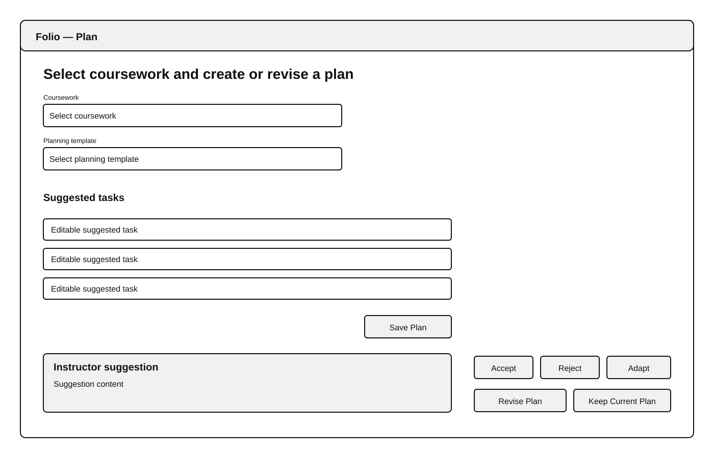
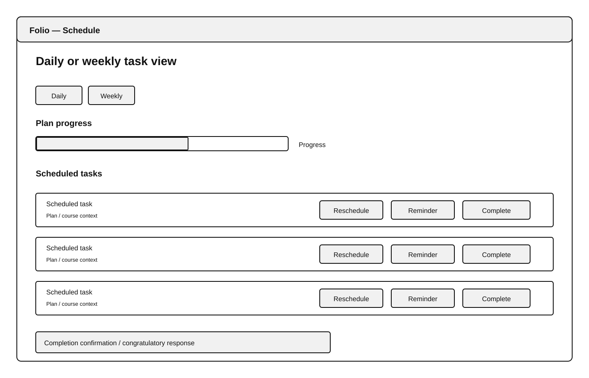
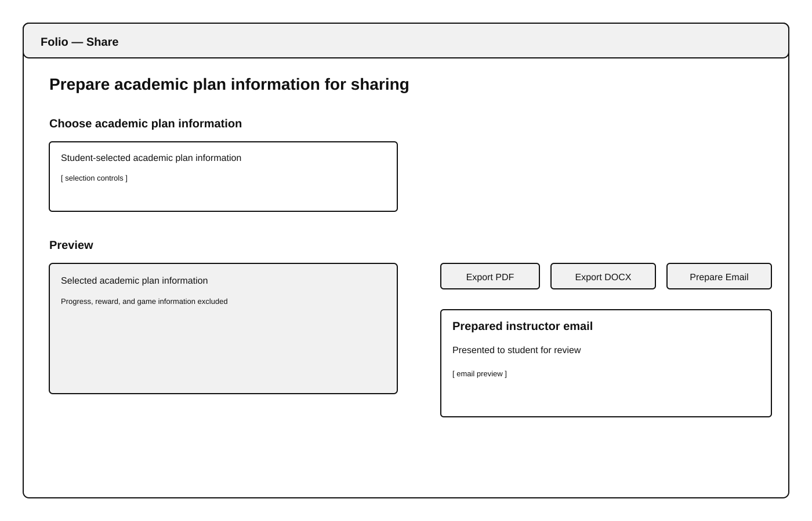

# Folio Design Document — Nicholas Half

# User-Facing Modules and Interfaces

## Plan and Feedback

The Plan and Feedback module supports the student-controlled planning workflow. It allows the student to select coursework, choose a planning template, edit suggested tasks, and save the plan. When instructor feedback is available, the student can accept, reject, or adapt a suggestion and then decide whether to revise the plan. The planning workflow remains usable without instructor participation.

### Interface

| Method | Function |
|---|---|
| `select_coursework(coursework_id)` | Selects the coursework the plan addresses. |
| `choose_template(template_id)` | Selects a planning template. |
| `edit_task(task_id, changes)` | Applies student edits to a suggested task. |
| `review_suggestion(suggestion_id, decision, changes=None)` | Records an accept, reject, or adapt decision for an instructor suggestion. |
| `save_plan(plan_id)` | Saves the current plan or revision. |

## Schedule and Completion

The Schedule and Completion interface provides daily and weekly task views. The student can reschedule a task, configure reminders, and mark a task complete. A proposed rescheduling conflict is reported to the student rather than silently resolved. Completing a task updates its saved completion state and the progress shown for its plan and produces a congratulatory response.

The existing `Schedule` class provides task retrieval, conflict detection, and rescheduling behavior.

### Interface

| Method | Function |
|---|---|
| `get_tasks()` | Returns scheduled tasks. |
| `get_tasks_for_plan(plan_id)` | Returns the tasks belonging to one plan. |
| `find_conflicts(task)` | Returns tasks that conflict with a proposed task time. |
| `reschedule_task(task_id, new_start_time, new_end_time)` | Applies a student-requested rescheduling when no conflict prevents it. |
| `configure_reminder(task_id, settings)` | Stores reminder settings for a task. |
| `set_task_complete(task_id, completed)` | Updates the task's completion state. |
| `get_plan_progress(plan_id)` | Returns progress based on the saved completion states of that plan's tasks. |

## Sharing and Export

The Sharing and Export module allows the student to choose which academic plan information is prepared for sharing. Information used for academic sharing excludes progress, reward, and game information.

The filtered academic information is used for PDF export, DOCX export, and preparation of an instructor email. The prepared email is presented to the student for review before sending.

### Interface

| Method | Function |
|---|---|
| `select_share_content(plan_id, selected_fields)` | Selects the academic plan information the student chooses to share. |
| `get_shareable_academic_data(plan_id, selected_fields)` | Returns the selected academic information while excluding progress, reward, and game information. |
| `export_pdf(academic_data)` | Produces a PDF containing the selected academic information. |
| `export_docx(academic_data)` | Produces a DOCX containing the selected academic information. |
| `prepare_instructor_email(academic_data)` | Prepares an instructor email and returns it for student review. |

# GUI Mock-Ups

## Plan Screen

The Plan screen provides coursework selection, planning-template selection, editing of suggested tasks, and plan saving. When instructor feedback is available, it also provides controls to accept, reject, or adapt the suggestion and to decide whether to revise the plan.

*Figure 1. Plan screen mock-up.*

## Schedule Screen

The Schedule screen provides daily and weekly task views, plan progress, and controls for rescheduling, reminder configuration, and task completion. Completion feedback is displayed after a task is completed.

*Figure 2. Schedule screen mock-up.*

## Share Screen

The Share screen allows the student to choose academic plan information, review the selected information, export it as PDF or DOCX, or prepare an instructor email. Progress, reward, and game information is excluded from the academic information shown for sharing. The prepared email is shown to the student for review.

*Figure 3. Share screen mock-up.*
